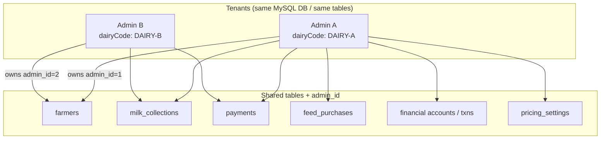
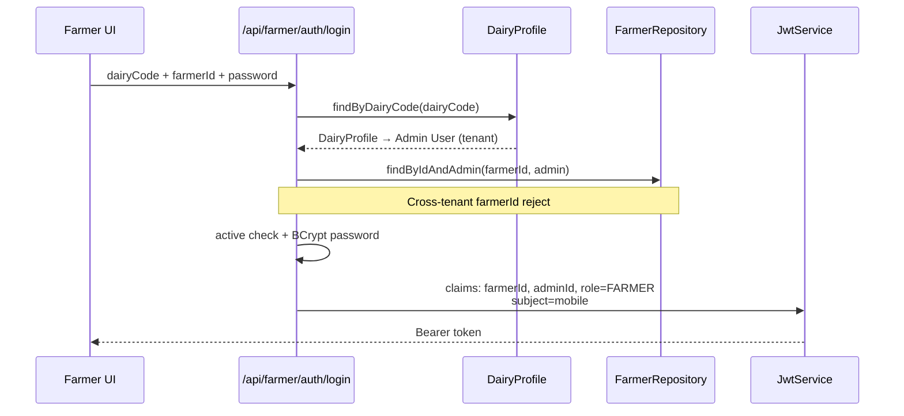
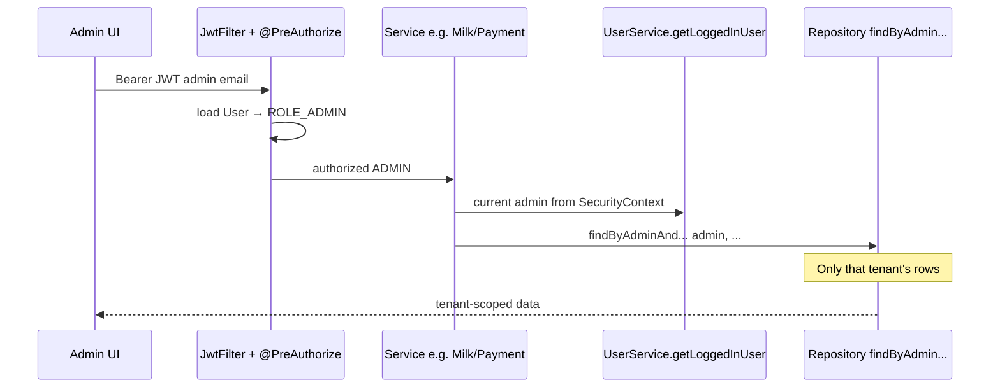
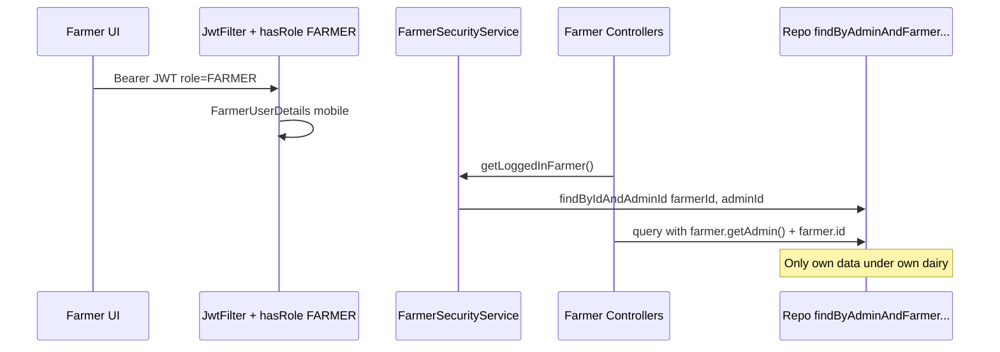

# Multi-Tenancy & RBAC — Interview Guide (Smart Dairy)

Yeh document **exact codebase implementation** par based hai. Interview mein theory + flow + Q&A explain karne ke liye use karo. Assumed / guessed features include nahi kiye.

---

## 1. Multi-Tenancy Model (Exact Theory)

| Concept | Implementation in this project |
|--------|--------------------------------|
| Tenant kaun hai? | Har **Admin `User`** = ek dairy tenant |
| Tenant identifier | DB mein `admin_id`; farmer login pe **`dairyCode`** (`DairyProfile`) |
| Isolation kaise? | Har business row pe `admin_id` + queries hamesha current admin se filter |
| Pattern name | **Row-level / discriminator-column multi-tenancy** (application-managed) |
| DB strategy | **Shared database + shared schema** (alag DB / schema per dairy nahi) |

### Interview one-liner

> We implemented shared-schema multi-tenancy where each dairy admin is a tenant. All operational data is scoped by `admin_id`, and every service query filters by the logged-in admin so one dairy never sees another dairy’s farmers, milk, payments, or ledger.

### Kya use nahi kiya

- Schema-per-tenant
- Database-per-tenant
- Hibernate `@TenantId` / automatic tenant filter
- PostgreSQL Row-Level Security (RLS)

Isolation **application layer** pe explicit `admin_id` filtering se hoti hai.

---

## 2. Multi-Tenant Flow Diagrams

### 2.1 Tenant ownership (same DB / same tables)



### 2.2 Farmer login — tenant resolve



**Code path:** `FarmerAuthServiceImpl.login`

1. `dairyProfileRepository.findByDairyCode(dairyCode)` → tenant admin
2. `farmerRepository.findByIdAndAdmin(farmerId, admin)` → farmer must belong to that dairy
3. Active + password checks
4. JWT extra claims: `farmerId`, `adminId`, `role=FARMER`; subject = farmer mobile

### 2.3 Admin request — tenant filter



**Pattern in services:**

```text
User admin = userService.getLoggedInUser();
repository.findByAdminAndId(admin, id);
entity.setAdmin(admin);   // on create
```

Used in: `FarmerServiceImpl`, `MilkCollectionServiceImpl`, `PaymentServiceImpl`, `FeedPurchaseServiceImpl`, financial ledger, reports, dashboard, pricing, bills, etc.

### 2.4 Farmer request — self + tenant scope



**Code path:**

- Controllers: `FarmerMilkCollectionController`, `FarmerPaymentController`, `FarmerFeedPurchaseController`, `FarmerProfileController`
- Class-level: `@PreAuthorize("hasRole('FARMER')")`
- Resolve farmer: `FarmerSecurityService.getLoggedInFarmer()`
- Queries always include `farmer.getAdmin()` + farmer id

---

## 3. Domain Ownership Graph (Whiteboard)

```text
User (ADMIN)  ←── tenant root
   │
   ├── DairyProfile (dairyCode)     ← farmer login tenant key
   ├── PricingSettings
   ├── Farmer[]
   │      └── MilkCollection / Payment / FeedPurchase / Bills / Ledger
   └── all operational rows carry admin_id
```

### Important entity notes

| Entity | Tenant link |
|--------|-------------|
| `Farmer` | `@ManyToOne User admin` (`admin_id`), unique `(admin_id, aadhaar_number)` |
| `MilkCollection` | `admin_id` + `farmer_id` |
| `Payment` | `admin_id` + `farmer_id` + 1:1 milk collection |
| `FeedPurchase` | `admin_id` + `farmer_id` |
| `FarmerBill` | `admin_id` + `farmer_id` |
| `FarmerFinancialAccount` | unique admin+farmer pair |
| `PricingSettings` | per admin |
| `DairyProfile` | one-to-one with admin user (`dairyCode`) |

Same Aadhaar theoretically do dairies (tenants) mein alag `admin_id` ke under allowed — unique constraint is **per tenant**, not global.

---

## 4. RBAC — Exact Implementation

RBAC = **Role-Based Access Control**. Is project mein **do layers** hain:

1. **Authentication** — JWT se identity prove karna  
2. **Authorization** — role + data ownership se access control

### 4.1 Roles

- Table: `roles`
- Seeded by `RoleDataInitializer`: `"ADMIN"`, `"FARMER"`
- Spring authorities: `ROLE_ADMIN`, `ROLE_FARMER`
  - Admin: `User.getAuthorities()` → `ROLE_` + role.name
  - Farmer: `FarmerUserDetails.getAuthorities()` → `ROLE_FARMER`

### 4.2 Dual login (alag principals)

| | Admin | Farmer |
|--|-------|--------|
| Endpoint | `POST /api/auth/login` | `POST /api/farmer/auth/login` |
| Credentials | email + password (`users`) | dairyCode + farmerId + password (`farmers`) |
| JWT subject | email | mobile number |
| Extra claims | typically no `role=FARMER` claim | `farmerId`, `adminId`, `role=FARMER` |
| Principal type | `User` (implements UserDetails) | `FarmerUserDetails` |

### 4.3 JWT filter branching (`JwtAuthenticationFilter`)

```text
Authorization: Bearer <token>
        ↓
extract username (subject) + claim "role"
        ↓
if role == "FARMER"
    → farmerRepository.findByMobileNumber(username)
    → FarmerUserDetails
else
    → userRepository.findByEmail(username)
    → User (admin)
        ↓
set Authentication in SecurityContext
```

Auth endpoints (`/api/auth/**`, `/api/farmer/auth/**`) JWT filter skip karte hain.

### 4.4 Method security (API RBAC)

`SecurityConfig` → `@EnableMethodSecurity`

| Annotation | Use |
|------------|-----|
| `@PreAuthorize("hasRole('ADMIN')")` | Admin-only APIs (milk, payments, feed, reports, ledger, dashboard…) |
| `@PreAuthorize("hasRole('FARMER')")` | Farmer portal APIs |
| `@PreAuthorize("hasAnyRole('ADMIN','FARMER')")` | Shared (AI chat, pricing read, dairy profile read, some farmer lookups) |

Public (permitAll) examples: login/register/forgot-password, farmer login, swagger, `/api/home/public`, `/send-sms`.

Baaki sab `.authenticated()`.

### 4.5 Frontend RBAC

| Piece | Behavior |
|-------|----------|
| Login toggle | Admin vs Farmer login forms |
| Storage | `localStorage`: `token`, `role` (`ADMIN` \| `FARMER`) |
| `ProtectedOutlet` | no token → `/login` |
| `AdminOutlet` | role ≠ ADMIN → `/farmer/dashboard` |
| `FarmerOutlet` | role ≠ FARMER → `/home` |
| Axios client | `Authorization: Bearer <token>`; 401 → clear + redirect login |
| Sidebars | Admin vs Farmer different menus |

### Interview one-liner (RBAC)

> RBAC is enforced at API level with Spring method security, and data access is further restricted by tenant ownership. A farmer JWT cannot call admin APIs, and even with a valid farmer role they only read their own records under their admin_id.

---

## 5. RBAC vs Multi-Tenancy (Clear Difference)

| | RBAC | Multi-Tenancy |
|--|------|----------------|
| Question | *Kya* kar sakta hai? | *Kis dairy* ka data? |
| Example | ADMIN can create milk entry; FARMER cannot | Admin A cannot see Admin B farmers |
| Mechanism | `@PreAuthorize`, roles, dual JWT principals | `admin_id` on rows + `findByAdmin...` |
| Failure mode | 403 Forbidden | Empty / 404 ResourceNotFound |

**Combined:** Farmer of Dairy A cannot hit admin APIs **and** cannot see Dairy B data.

---

## 6. Data Isolation Pattern (Sabse Important Code Theory)

### On create (tenant stamp)

```text
User admin = userService.getLoggedInUser();
entity.setAdmin(admin);
repository.save(entity);
```

### On read / update / delete (tenant filter)

```text
User admin = userService.getLoggedInUser();
repository.findByAdminAndId(admin, id)
repository.findByIdAndAdmin(farmerId, admin)
```

### How admin is resolved

```text
SecurityContext → authentication.getName()   // SecurityUtil
        ↓
UserService.getLoggedInUser()
        ↓
userRepository.findByEmail(email)
```

### How farmer is resolved

```text
SecurityContext principal instanceof FarmerUserDetails
        ↓
farmerId + adminId from FarmerUserDetails
        ↓
farmerRepository.findByIdAndAdminIdWithAdmin(farmerId, adminId)
```

**Matlab:**

- Role check = permission boundary  
- `admin_id` filter = tenant data boundary  

Dono chahiye secure SaaS dairy system ke liye.

---

## 7. Key Classes (Interview Mein Naam Lo)

| Class | Responsibility |
|-------|----------------|
| `SecurityConfig` | JWT filter chain, permitAll, stateless session, `@EnableMethodSecurity` |
| `JwtService` | Create / parse / validate HS256 JWT |
| `JwtAuthenticationFilter` | Bearer parse; FARMER vs ADMIN principal load |
| `FarmerUserDetails` | Farmer as Spring `UserDetails`; `ROLE_FARMER`; exposes `farmerId` / `adminId` |
| `FarmerSecurityService` | Logged-in farmer resolve with tenant check |
| `FarmerAuthServiceImpl` | dairyCode → admin → farmer login + JWT claims |
| `UserServiceImpl` / `SecurityUtil` | Current admin from SecurityContext |
| `RoleDataInitializer` | Seed ADMIN / FARMER roles |
| `TenantDataBackfillService` | Legacy rows pe missing `admin_id` backfill (startup) |
| `*ServiceImpl` (milk, payment, feed, farmer…) | Always `getLoggedInUser()` + `findByAdmin...` |

---

## 8. End-to-End Flows (Bolne Layak)

### Flow A — New dairy (tenant) onboarding

1. Admin registers / logs in → JWT  
2. Admin sets `DairyProfile` (including `dairyCode`)  
3. Admin sets `PricingSettings`  
4. Admin creates farmers → each row stamped with `admin_id`  
5. All future milk/payments/feed/ledger rows inherit same tenant

### Flow B — Farmer enters own portal

1. Farmer enters `dairyCode` + `farmerId` + password  
2. System resolves dairy → admin tenant  
3. Verifies farmer belongs to that admin  
4. Issues farmer JWT with `adminId` + `role=FARMER`  
5. Farmer APIs only return that farmer’s data under that admin

### Flow C — Cross-tenant attack blocked

1. Farmer from Dairy A tries farmerId of Dairy B with Dairy A code → `findByIdAndAdmin` fails  
2. Admin A requests payment id belonging to Admin B → `findByAdminAndId` fails / not found  
3. Farmer token calls `/api/milk-collections` (ADMIN only) → `@PreAuthorize` denies

---

## 9. Architecture Stack (Auth + Tenant Context)

```text
Frontend (React)
  role in localStorage + route outlets
        ↓ Bearer JWT
JwtAuthenticationFilter
  role claim → Admin User OR FarmerUserDetails
        ↓
@PreAuthorize (RBAC)
        ↓
Service layer
  getLoggedInUser() OR getLoggedInFarmer()
        ↓
Repository
  findByAdmin... / findByIdAndAdmin...
        ↓
MySQL shared schema (admin_id discriminator)
```

---

## 10. Interview Q&A Bank

### Q1: How did you implement multi-tenancy?

**A:** Shared DB/schema. Tenant = Admin user. `admin_id` on farmers, milk, payments, feed, ledger, pricing. Services always resolve `getLoggedInUser()` and query `findByAdmin...`. Farmer login resolves tenant via `dairyCode` → `DairyProfile` → admin, then verifies farmer belongs to that admin.

### Q2: How is RBAC different from multi-tenancy?

**A:** RBAC controls *permissions* (Admin vs Farmer) via JWT + `@PreAuthorize`. Multi-tenancy controls *data isolation* (Admin A vs Admin B) via `admin_id`. We use both together.

### Q3: Why not schema-per-tenant or DB-per-tenant?

**A:** For this product scale, shared schema is simpler: one migration path, one deployment. Isolation is enforced consistently with `admin_id` filtering. Trade-off: every query must include the tenant filter; a missed filter is a data-leak risk — so repositories are explicitly named `findByAdmin...`.

### Q4: Did you use Hibernate `@TenantId` / filters?

**A:** No. Explicit application-level tenancy through `UserService.getLoggedInUser()` and repository methods. No transparent Hibernate multi-tenant filter.

### Q5: How is a farmer blocked from another dairy’s data?

**A:** Login uses `findByIdAndAdmin`. Each request resolves `getLoggedInFarmer()` with `farmerId + adminId`. Queries always include that admin. Wrong dairy code / farmerId → not found / invalid.

### Q6: What is the role of `adminId` in the farmer JWT?

**A:** It stores tenant context in the token. On each request, `FarmerUserDetails` / `FarmerSecurityService` reloads and verifies the farmer against that admin so portal APIs stay tenant-scoped.

### Q7: Where is authorization enforced — frontend or backend?

**A:** Both, but **backend is source of truth**. Frontend outlets hide routes; Spring Security + service-level tenant filters enforce real access. UI-only checks are never enough.

### Q8: How do ADMIN and FARMER tokens differ?

**A:** Admin token subject is email and loads `User` with `ROLE_ADMIN`. Farmer token subject is mobile, includes claims `role=FARMER`, `farmerId`, `adminId`, and loads `FarmerUserDetails` with `ROLE_FARMER`.

### Q9: What happens if two dairies have the same farmer id number?

**A:** Farmer primary key is global, but login is scoped: `dairyCode` selects admin first, then `findByIdAndAdmin(farmerId, admin)`. Without matching tenant, login fails. Aadhaar uniqueness is also per `(admin_id, aadhaar_number)`.

### Q10: Weak points / improvements (honest answer — impresses interviewers)

**A:**

1. Shared schema → missing `admin_id` filter in a new query can leak data; needs discipline / maybe Hibernate filters later  
2. Farmer JWT filter loads by **mobile number** — edge case if same mobile exists across dairies  
3. No DB-level RLS yet — isolation is app-layer only  
4. Not full commercial SaaS tenancy yet (plans, billing, org hierarchy)  
5. Secrets should stay in env/secret manager, not committed property files  

### Q11: Is this SaaS multi-tenant?

**A:** Yes at the **application data model** level: multiple dairy admins (tenants) share one app/DB with row-level isolation. It is not yet full commercial SaaS (subscriptions, tenant provisioning portal, etc.), but the core tenancy isolation pattern is implemented.

---

## 11. 30-Second Elevator Answer (Memorize)

> In Smart Dairy, multi-tenancy is row-level: each dairy admin is a tenant identified by `admin_id`, with `dairyCode` for farmer login. All milk, payments, feed, and ledger rows are owned by that admin and queried only through the logged-in admin. RBAC uses JWT with two principals—Admin User and FarmerUserDetails—and Spring `@PreAuthorize` so admin APIs and farmer portal APIs stay separated, while tenant filters prevent cross-dairy data access.

---

## 12. 2-Minute Full Answer Structure

1. **Problem:** Multiple dairies on one platform; data must not mix; Admin and Farmer need different permissions.  
2. **Tenancy:** Shared schema; tenant = Admin; `admin_id` on all ops tables; `dairyCode` for farmer entry.  
3. **RBAC:** Dual login + JWT + `ROLE_ADMIN` / `ROLE_FARMER` + `@PreAuthorize`.  
4. **Enforcement:** Services call `getLoggedInUser()` / `getLoggedInFarmer()` and repositories filter by admin (and farmer id).  
5. **Frontend:** Role-based routes/outlets (UX only).  
6. **Result:** Permission boundary + data boundary together = secure multi-tenant dairy ERP.

---

## 13. Quick Cheat Sheet

```text
Multi-tenancy type     = Shared DB + shared schema + admin_id discriminator
Tenant root            = Admin User
Farmer tenant key      = dairyCode → DairyProfile → admin
RBAC roles             = ADMIN, FARMER
Auth                   = JWT (HS256), stateless
Admin principal        = User / email
Farmer principal       = FarmerUserDetails / mobile
API guard              = @PreAuthorize
Data guard             = findByAdmin... / findByIdAndAdmin...
Frontend guard         = ProtectedOutlet + AdminOutlet + FarmerOutlet
```

---

## 14. Related Source Files

```text
src/main/java/com/smartdairy/config/SecurityConfig.java
src/main/java/com/smartdairy/config/RoleDataInitializer.java
src/main/java/com/smartdairy/config/TenantDataBackfillInitializer.java
src/main/java/com/smartdairy/security/JwtAuthenticationFilter.java
src/main/java/com/smartdairy/security/JwtService.java
src/main/java/com/smartdairy/security/FarmerUserDetails.java
src/main/java/com/smartdairy/security/FarmerSecurityService.java
src/main/java/com/smartdairy/security/SecurityUtil.java
src/main/java/com/smartdairy/service/impl/FarmerAuthServiceImpl.java
src/main/java/com/smartdairy/service/impl/UserServiceImpl.java
src/main/java/com/smartdairy/service/impl/FarmerServiceImpl.java
src/main/java/com/smartdairy/service/impl/MilkCollectionServiceImpl.java
src/main/java/com/smartdairy/service/impl/PaymentServiceImpl.java
src/main/java/com/smartdairy/controller/Farmer*Controller.java
frontend/src/components/AdminOutlet.jsx
frontend/src/components/FarmerOutlet.jsx
frontend/src/components/ProtectedOutlet.jsx
frontend/src/utils/auth.js
frontend/src/pages/LoginPage.jsx
```

---

*Document generated from actual Smart Dairy / DAIRY360 implementation for interview preparation.*
